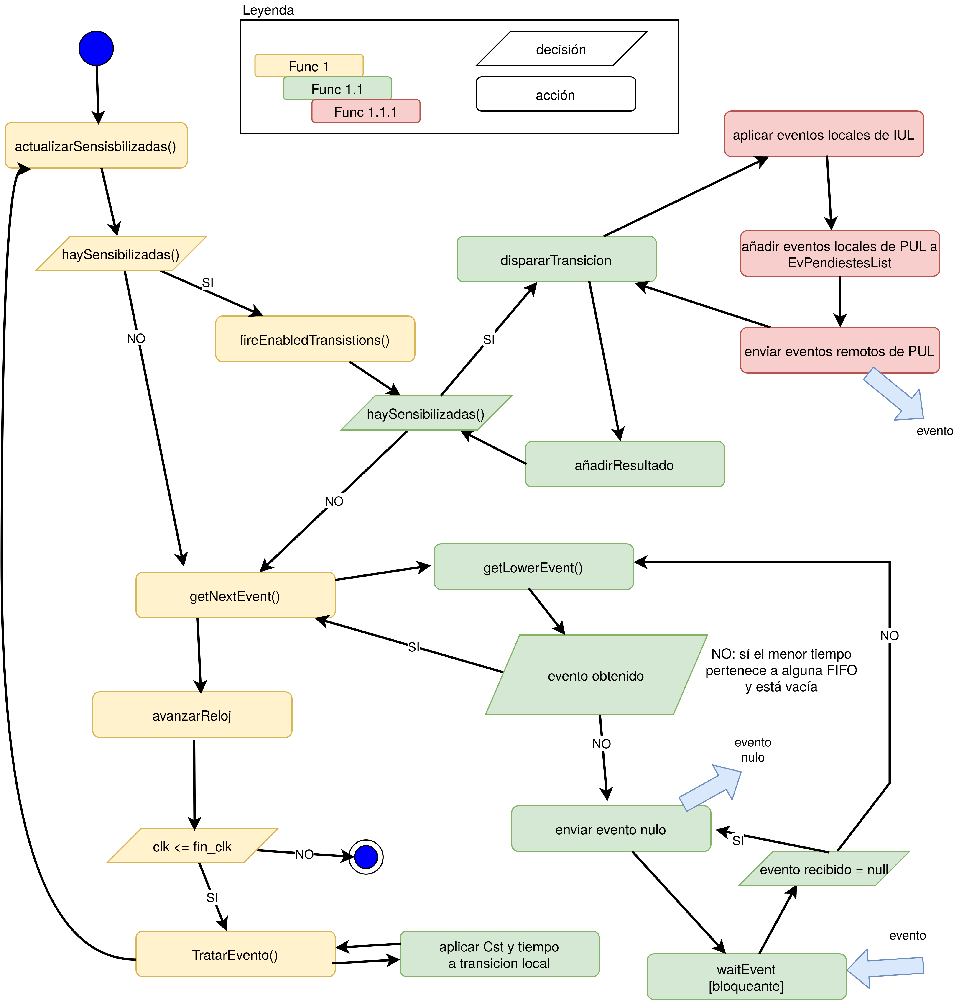

## Intro
A distributed and conservative Petri net simulator using the Chandy-Mysra-Bryant 
algorithm to avoid global deadlock.

For further information check out the [Spanish report](doc/memoria_miniproyecto_Marius_Crisan.pdf).

## Architecture

Class diagram.

State/activity diagram.

##Setup
- Define the LEFs (Linear Enabling Functions) of the different subnets in the files [\<prefix\>.subred.json](code/simuladores/cmd/distsim/testdata/2subredes.network.json)
  located in `cmd/distsim/testdata`  
- Define in the the [*.network.json](code/simuladores/cmd/distsim/testdata/2subredes.network.json) files the information 
  relative to the nodes/machines used for simulating the respective Petri subnets.
- To run the tests, execute the script [run.sh](code/simuladores/cmd/distsim/run.sh)

## Legal info
This project is part of an academic project of the subject [Distributed Systems and Networking](https://estudios.unizar.es/estudio/asignatura?anyo_academico=2019&asignatura_id=62223&estudio_id=20190683&centro_id=110&plan_id_nk=534)
(Master's degree in IT Engineering). The distributed Petri nets simulator was developed from a
centralized simulator provided by the prof. Arronategui Arribalzaga, Unai. 